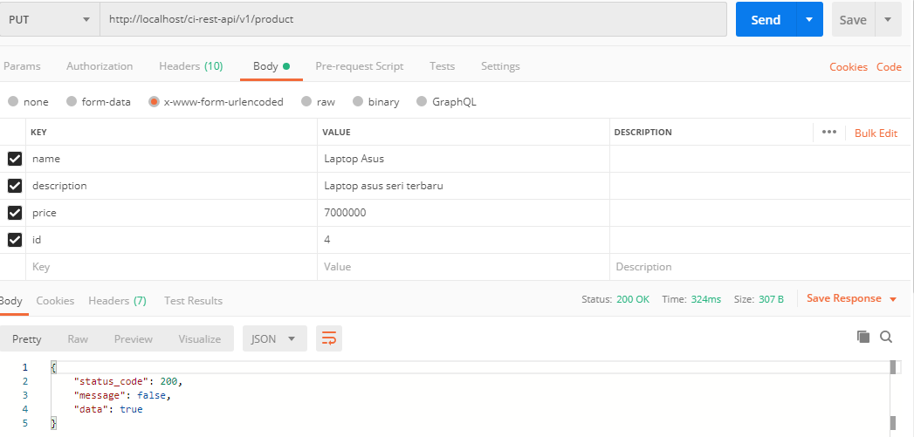
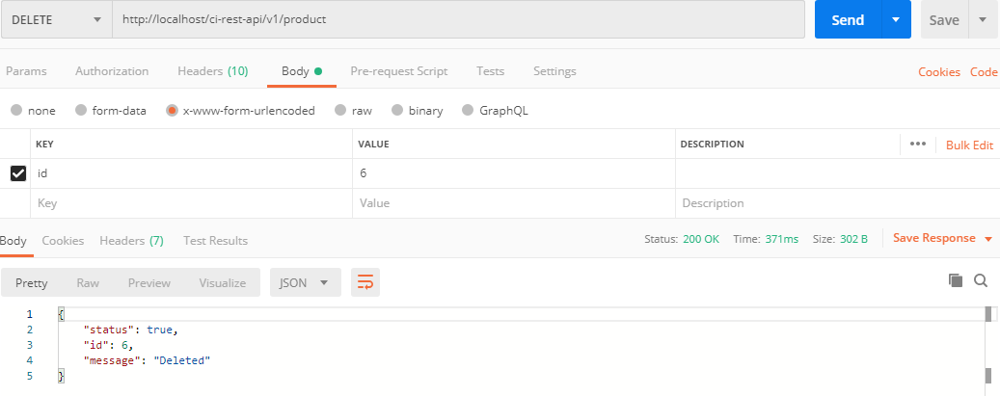

# ci-rest-structure
CodeIgniter HMVC rest api structure with JWT integration

# Dependencies
PHP 5.x above
Composer [https://getcomposer.org/]

#Installation instructions
```Run composer install ``` to install all the vendor dependacies
Config database file to test the project
"# ci-rest-api" 

# Endpoint

## List Barang
Method GET <br />
http://localhost/ci-rest-api/v1/product

## GET Barang By Id
Method GET <br />
http://localhost/ci-rest-api/v1/product/:id <br />
example : http://localhost/ci-rest-api/v1/product/?id=4

## Post Barang
Method GET <br />
http://localhost/ci-rest-api/v1/product/ <br />
example for request body : <br/>
{<br/>
	"name":"Handphone",<br/>
	"description":"iphone x",<br/>
	"price":"15000000"<br/>
}

## Put (Update Barang by Id)
Method PUT <br />
http://localhost/ci-rest-api/v1/product/ <br />


## Delete (Delete barang)
Method DELETE <br />
http://localhost/ci-rest-api/v1/product/ <br />



